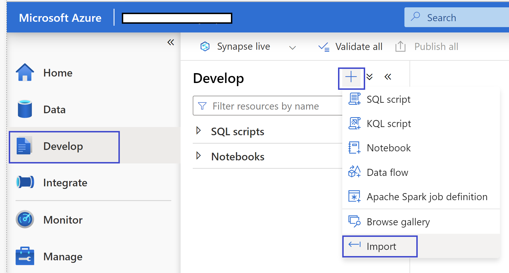
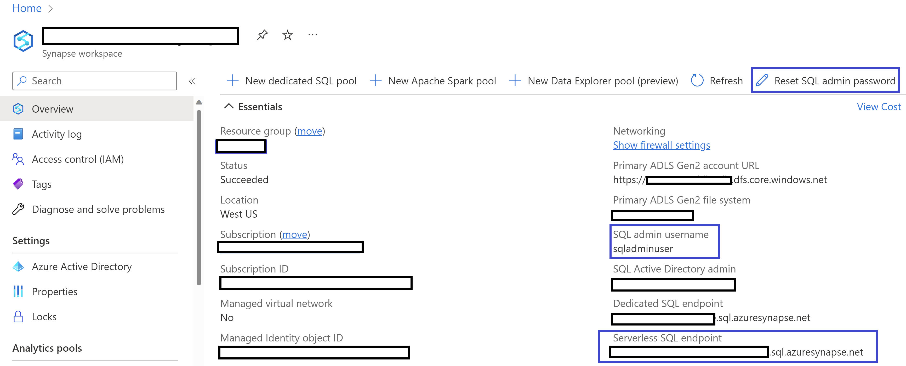
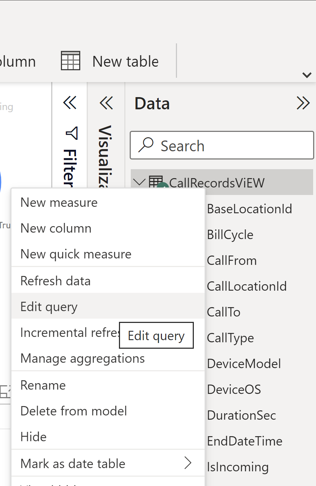
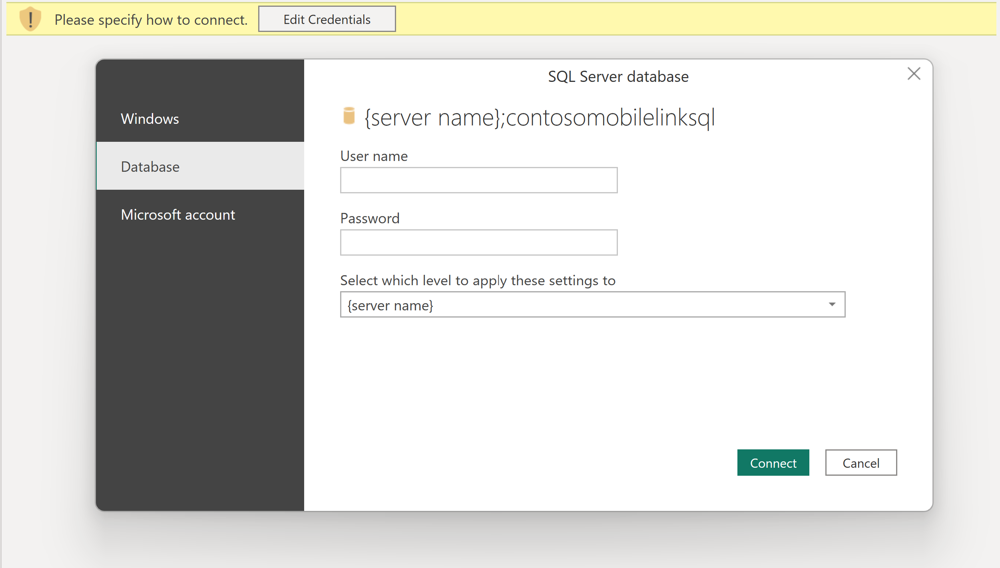

# Demo Scenarios

#### 1. HTAP Demo using Synapse Link for Cosmos DB

An end to end demonstration of Cloud-native hybrid transactional and analytical processing (HTAP) capability that enables near real time analytics over operational data in Azure Cosmos DB using Azure Synapse Link for Cosmos DB.

Synapse Link for Cosmos DB automatically syncs data between the Transaction store and Analytical store. The analytical store data can be processed using SQL Serverless or Spark runtime, thus making the analytical workload cost effective and independent of the transactional compute resources.

#### 2. Instant Scalbility and Change Feed Demo/Materialized view

Demonstrate how Cosmos DB can handle large data volumes instantanteously using auto scale. The demo uses Chnage feed to show how secondary containers can be upserted based on the data ingested into primary container./

## Setting up the Environment

### Create your Cosmos DB SQL Account

1. Refer to [Create an Azure Cosmos DB SQL API account](https://docs.microsoft.com/azure/cosmos-db/sql/how-to-create-account?tabs=azure-portal)

2. Create a database called "ContosoMobile".
3. Create a collection called "CallRecords" with Provisioned Throughput and '/pk' as PartitionKey. Calculate your RU requirements based on the number of documents you plan to ingest in a sec. Use 8 RU/doc as your formaula. For e.g if you plan to ingest 1000 docs/sec, use 8,000 RU in Autoscale as throughput.
4. Create a collection called "Bills" with Provisioned Throughput and '/id' as PartitionKey. Calculate your RU requirements based on the number of distinct subscribers you plan to have. Use 8 RU/subscriber as your formaula. For e.g if you plan to have 10,000 subscribers, use 80,000 RU in Autoscale as throughput.
5. Create a collection called "UnBilledCallRecords" with Provisioned Throughput and '/id' as PartitionKey. Calculate your RU requirements based on the number of distinct subscribers you plan to have. Use 8 RU/subscriber as your formaula. For e.g if you plan to have 10,000 subscribers, use 80,000 RU in Autoscale as throughput.


### Create your Synapse Workspace
The below steps will create an Azure Synapse workspace using the Azure portal.

1. Open the Azure portal, and at the top search for Synapse.

2. In the search results, under Services, select Azure Synapse Analytics.
3. Select Add to create a workspace.
4. In the Basics tab, give the workspace a unique name. We'll use mysworkspace in this document
5. You need an ADLSGEN2 account to create a workspace. The simplest choice is to create a new one.
    1. Under Select Data Lake Storage Gen 2, click Create New and name it contosolake.
    2. Under Select Data Lake Storage Gen 2, click File System and name it contosofs.

6. Select Review + create > Create. Your workspace will be ready in a few minutes.

After your Azure Synapse workspace is created, you have two ways to open Synapse Studio:

1. Open your Synapse workspace in the Azure portal. On the top of the Overview section, select Launch Synapse Studio.
2. Go to the https://web.azuresynapse.net and sign in to your workspace.

### Add Cosmos DB as linked Database
Refer to [Connect an Azure Cosmos DB database to a Synapse workspace](https://docs.microsoft.com/azure/synapse-analytics/quickstart-connect-synapse-link-cosmos-db#connect-an-azure-cosmos-db-database-to-a-synapse-workspace)

### Enable Synapse Link in a Cosmos DB Account

Refer to [Enable Synapse Link in your Cosmos DB SQL API or MongoDB API account using Azure CLI or PowerShell](https://docs.microsoft.com//azure/cosmos-db/configure-synapse-link#command-line-tools).

**Note:** If you can enable Synapse link via the Azure portal you will not be able to set analytical storage to FullFidelity. Therefore, we will enable Synapse Link and set schema using CLI.

Replace the {Cosmos Account Name} placeholder with your own value and run the below command to enable Synapse link on your Cosmos DB Account.

```azurecli
az cosmosdb update --name {Cosmos Account Name} --analytical-storage-schema-type FullFidelity --enable-analytical-storage true
```

### Import the Spark Notebook and SQL View in Synapse

1. In Synapse Studio, Open the Develop Blade
2. Click on the "+" icon and then select Import.
3. Browse and locate the Spark Notebook and SQL View files.

    

### Update Cosmos Connection Details in Applications

1. Download or clone this repo and open the "BulkCallIngestWinAppContosoMobile.sln" folder in Visual Studio.
2. Edit BulkCallIngestWinApp\appsettings.json to replace the {Cosmos Account Name} and {Cosmos PRIMARY Key} placeholders with your own value.
3. Edit BulkCallIngestCmdApp\appsettings.json to replace the {Cosmos Account Name} and {Cosmos PRIMARY Key} placeholders with your own value.
4. Build the solution.

## Demo 1: HTAP Capability

### Generate Sample Data using Windows Application

1. Navigate to "BulkCallIngestWinApp" folder and execute the **BulkCallIngestWinApp.exe**.
2. Set the number of document to be ingested in the text box. Click "Run Once" to generate one set of  call logs and ingest it to the CallRecords collection in Cosmos DB.
3. Optionally, Set the number of document to be ingested/sec in the text box. Click "Start Timer" to generate bulk call logs on a per second basis. Use "Stop Timer" to stop the ingestion.

### Configure SQL Serverless

1. Open the **CreateView** SQL file from the Develop tab in Synapse Studio.
2. Update the {Cosmos Account Name} and {Cosmos PRIMARY Key} placeholders.
3. Execute the scripts to create the SQL View. Follow the instructions provided as comments.
4. To connect to the SQl Serverless, get the connection details from the Synapse workspace Overview tab.
    1. Generate the password using **Reset SQL admin password** link.
    2. Use **Severless SQL endpoint** value as the Server Name
    3. Use **SQL admin username** value as the User Name

    

### Power BI Report

1. Navigate to "PowerBI" folder.
2. Open the .pbix file in Power BI Desktop window.
3. Click **Edit Query**
    
4. In the Power Query Editor, click **Advanced Editor**.
5. Update {Server Name} placeholder with **Severless SQL endpoint** value.
6. Click **Done**.
7. Click **Edit Credentials** to supply the SQL admin username and password. Select server from the dropdown and then Click **Connect**.\
 
8. Click **Close and Apply** to close the Power Query Editor.
9. Click **Refresh** to see updated data in the report.

### Spark Runtime : Generate Bill

1. Open the **GenerateBill** Spark Notebook from the Develop tab in Synapse Studio.
2. Execute the scripts in sequence. Follow the instructions provided.


## Demo 2 : Bulk Data Processing with Change Feed

### Bulk Request Processing using pods in AKS

In order to ingest bulk data into Cosmos we are going to use AKS pods. The following steps will prepare AKS, ACR and docker image to deploy pods in AKS.

#### Setup AKS and ACR

Follow the steps provided at https://learn.microsoft.com/en-us/azure/aks/cluster-container-registry-integration?tabs=azure-cli to prepare your ACR and AKS environments. Make sure to link your ACR with AKS.

#### Publish Docker Image and Upload to ACR

Follow the steps provided at https://learn.microsoft.com/en-us/visualstudio/containers/hosting-web-apps-in-docker?view=vs-2022#publish-your-container-to-azure-container-registry-1 

#### Deploy pods in AKS

Use the below YAML definition to create the pods. Remember to replace the {ACR NAME} placeholder and {REPLICA_COUNT} with the number of replicas you want.

**Note** : Each pod will require 4vCores and 8Gb RAM, ensure your AKS nodePool has enough resources to deploy the pods.

```yaml
 - apiVersion: v1
  kind: Namespace
  metadata:
    name: default-1674450242458
  spec:
    finalizers:
      - kubernetes
- apiVersion: apps/v1
  kind: Deployment
  metadata:
    name: bulkcallingestcmdapp
    namespace: ns_bulkcallingestcmdapp
  spec:
    replicas: {REPLICA_COUNT}
    selector:
      matchLabels:
        app: bulkcallingestcmdapp
    template:
      metadata:
        labels:
          app: bulkcallingestcmdapp
      spec:
        nodeSelector:
          kubernetes.io/os: linux
        containers:
          - name: bulkcallingestcmdapp
            image: {ACR NAME}/bulkcallingestcmdapp:latest
            ports: []
            resources:
              requests:
                cpu: '4'
                memory: 8G
              limits:
                cpu: '4'
                memory: 8G

```

Refer to https://learn.microsoft.com/en-us/azure/aks/tutorial-kubernetes-deploy-application?tabs=azure-cli#deploy-the-application for steps to deploy pods.


Refer to https://learn.microsoft.com/en-us/azure/aks/tutorial-kubernetes-scale?tabs=azure-cli#manually-scale-pods to scale the number of pods.

## Chnage Feed using Spark Runtime : Update MaterializedView UnbilledCallRecords

1. Open the **MaterializedView_ChangeFeed** Spark Notebook from the Develop tab in Synapse Studio.
2. Execute the scripts in sequence. Follow the instructions provided.
3. The Script will process the ChanageFeed from teh CallRecords Container and create a materialized View in the "UnBilledCallRecords" container.


## Additional Resources
- [Azure Synapse Link for Azure Cosmos DB, benefits, and when to use it](https://docs.microsoft.com/azure/cosmos-db/synapse-link)
- [Configure and use Azure Synapse Link for Azure Cosmos DB](https://docs.microsoft.com/azure/cosmos-db/configure-synapse-link)
- [Frequently asked questions about Azure Synapse Link for Azure Cosmos DB](https://docs.microsoft.com/en-us/azure/cosmos-db/synapse-link-frequently-asked-questions)